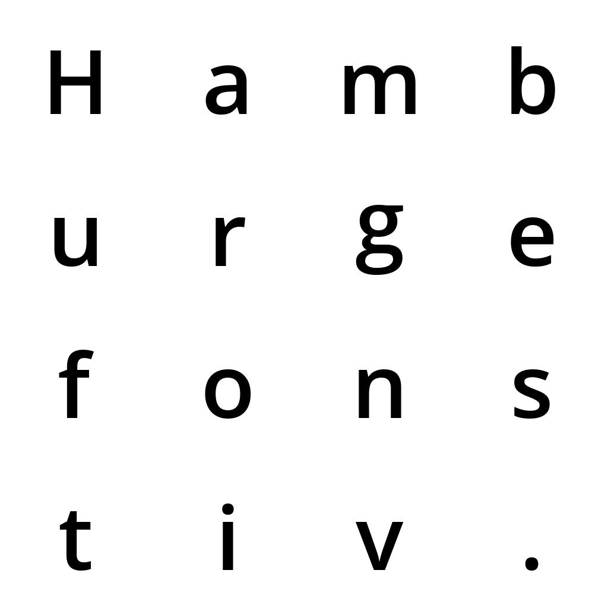

# Font image dataset

Contains scripts to scrape (non-offsite) free fonts from [fontsquirrel.com](https://www.fontsquirrel.com/) and create a dataset of 1024x1024px images showcasing the font

## Step-by-step process

### 1. download_fonts.py
Downloads fonts (.zip containing .ttf/.otf) into the `fontfiles` folder

`python download_fonts.py --url https://www.fontsquirrel.com/fonts/list/classification/sans%20serif --start 1 --end 2`

#### Params

`--url https://www.fontsquirrel.com/fonts/list/classification/sans%20serif`

*Url of the page that has list of downloadable fonts*

`--start 1`

*Page number to start scraping from*

`--end 2`

*Last page number to scrape*

### 2. unzip all .zip fontfiles
- `open *zip` (unarchiver mac)
- `unzip '*.zip'` (linux)

### 3. draw_fonts.py
Creates images (.jpg) for all fonts (or a single font) and saves it in the `imgs` folder

`python draw_fonts.py`

#### Optional param

`--f fontfiles/OpenSans-Semibold.ttf`

*Creates image for only the requested font*

## Requirements
`pip install requests beautifulsoup4 pillow tqdm`

## Why did I choose the word Hamburgefonstiv?
Because [wikipedia.org/Hamburgevons](https://en.wikipedia.org/wiki/Hamburgevons)

## Font Licenses
Refer [fontsquirrel.com/faq](https://www.fontsquirrel.com/faq)